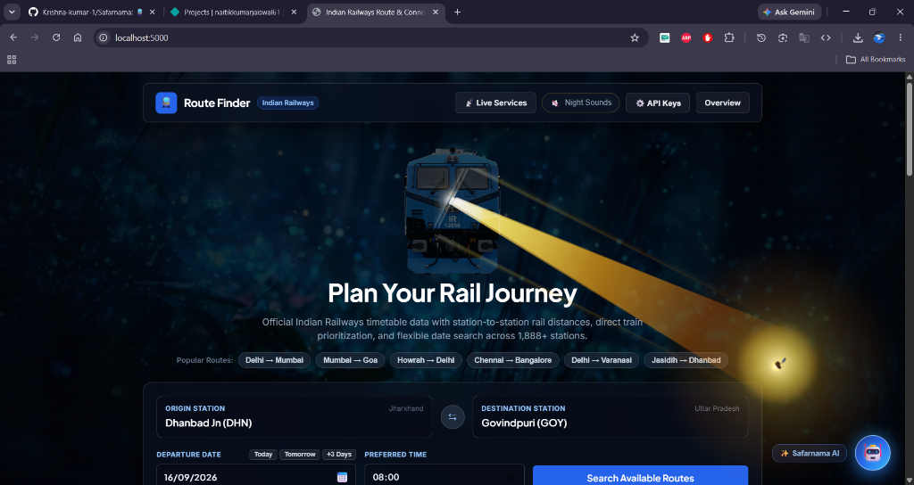
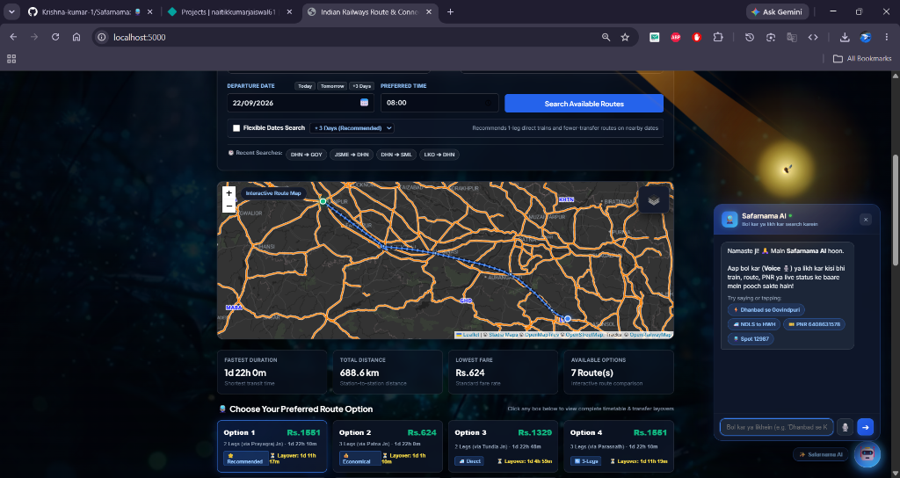
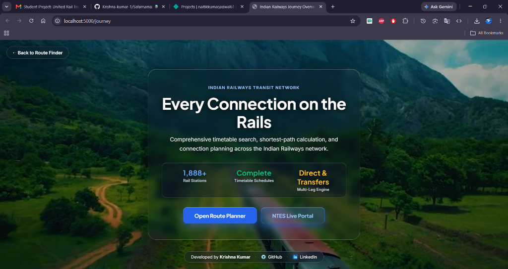
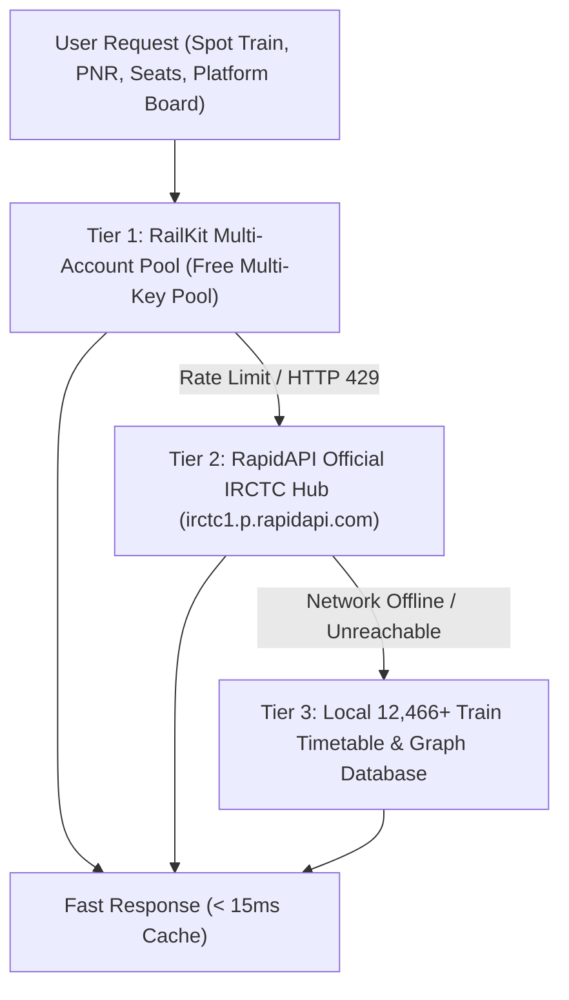

# 🚆 Safarnama: Indian Railways Route Finder & NTES Live Cloud Portal

<div align="center">

[](https://www.python.org/)
[](https://flask.palletsprojects.com/)
[](https://networkx.org/)
[](https://aistudio.google.com/)
[](https://github.com/Krishna-kumar-1/Safarnama)
[-brightgreen.svg)](tests/)
[](LICENSE)

<p align="center">
  <b>An intelligent, multi-modal Indian Railways routing engine, journey planner, and official National Train Enquiry System (NTES) live telemetry portal.</b>
</p>

<p align="center">
  Built with <b>Python Flask</b>, <b>NetworkX Dijkstra Graph Algorithms</b>, <b>Google Gemini 2.5 Flash AI</b>, <b>RailKit Multi-Pool SDK</b>, <b>Leaflet.js</b>, and an offline database of <b>12,466+ trains</b> across <b>1,894+ stations</b>.
</p>

---

### 📸 Live Prototype Screenshots

#### 1. Plan Your Rail Journey — Atmospheric Hero Search (`/`)
*Interactive locomotive headlights following cursor movement, bio-luminescent firefly glowing trail, procedural night forest soundscape, and quick station autocomplete across 1,894+ stations.*



#### 2. Interactive Railway Map, Route Options & Safarnama AI (`/`)
*Real-time Leaflet track mapping, multi-criteria route recommendations (Option 1 Recommended, Option 2 Economical, Option 3 Direct), journey metrics (duration, distance, fares), and Gemini 2.5 Flash voice & Hinglish AI Assistant.*



#### 3. Indian Railways Transit Network Overview (`/journey`)
*Panoramic landing portal highlighting 12,466+ train schedules, 1,888+ stations, and direct one-click navigation.*



</div>

---

## 🌟 Core Features

### 1. 🔍 Intelligent Multi-Modal Route Finder (`/`)
* ⚡ **Multi-Criteria Optimization**: Instant computation of **Fastest**, **Cheapest**, and **Recommended** routes using NetworkX Dijkstra shortest-path algorithms.
* 🚅 **Direct 1-Leg Train Prioritization**: Intelligently weights and prioritizes direct long-haul express trains over disjoint high-speed permutations.
* 🎫 **IRCTC Dynamic Class-Wise Fare Estimator**: Accurate telescopic fare calculation for **1A** (First AC), **2A** (AC 2-Tier), **3A** (AC 3-Tier), **3E** (AC Economy), **SL** (Sleeper), **CC** (Chair Car), and **2S** (Second Sitting).
* 💺 **Interactive 2D Visual Coach & Seat Map Modal**: True-to-life ICF & LHB coach layout diagrams for 1A, 2A, 3A, and Sleeper with neon-highlighted allocated berth placement.
* 📲 **1-Click WhatsApp Itinerary Sharing**: Clean, pre-formatted journey summary with train numbers, departure/arrival timings, total duration, and class fares ready to share.
* 🕒 **Recent Search History**: Persistent horizontal chip strip remembering your recent journeys for one-click re-querying.
* 📅 **Flexible Date Search (±1 to ±5 Days)**: Scans adjacent calendar dates to suggest direct 1-leg alternatives and faster travel days.
* 🗺️ **Dual Map Engine with Instant Switching**: Toggle seamlessly between **Google Satellite**, **Google Hybrid**, **Google Roads**, **Google Terrain**, **Stadia Dark (Neon Rail)**, **MapTiler Streets**, and the **OpenRailwayMap** real physical railway track network across India with one-click quick switch buttons and synchronized layer controls.
* 🌌 **Atmospheric Aesthetics**:
  * Bio-luminescent firefly cursor with realistic inverse-square light bloom and golden dust trails.
  * Interactive train locomotive headlights following cursor movement.
  * Zero-leak procedural night crickets soundscape generated dynamically via Web Audio API.

---

### 2. 🛰️ Official NTES Live Operations Portal (`/live`)
* 🔍 **Spot Your Train (3-Column Ladder Track View with Live Satellite Telemetry)**:
  * **Intelligent Active Rake Auto-Selection**: Identifies active trains running on tracks today or yesterday so you never see an unstarted future train by mistake.
  * **Accurate Intermediate Station Placement**: Tracks train position through intermediate non-commercial cabins and crossings.
  * **Live Moving Train Indicator 🚆**: Real-time glowing train icon positioned at its current halt.
  * **Platform Allocations & Delays**: Real-time platform badges (`PF 2*`), cumulative kilometers, and `ON TIME` / delay warnings.
* 🔔 **Live Station Digital Platform Board**: Digital railway platform display boards with scheduled/actual departure times, train numbers, and delay metrics.
* 📅 **Train Schedule Directory**: Complete station-by-station timetable with halt durations, cumulative distances, and platform allocations.
* 🚆 **Trains Between Stations**: Instant timetable directory between any two stations.
* ⚠️ **Train Exception Info**: Bulletins for **Cancelled**, **Rescheduled**, and **Diverted** trains.

---

### 3. 💺 Real-Time Seat Availability & Quotas
* 🎫 **Class Filtering**: `All Classes`, `1A`, `2A`, `3A`, `3E`, `SL`, `CC`, `2S`.
* 🏷️ **Quota Filtering**: `General (GN)`, `Tatkal (TQ)`, `Premium Tatkal (PT)`, `Ladies (LD)`, `Senior Citizen (SS)`.
* 💎 **ConfirmTkt & IRCTC Style Cards**:
  * Color-coded status pills: 🟢 **`AVAILABLE-42`**, 🟡 **`RAC-12`**, 🔴 **`WL-24`**.
  * **Confirmation Probability Progress Bar**: Real-time confirmation likelihood (e.g. *98% High Chance*).
  * **Direct Booking Button**: Direct link to official IRCTC booking portal.
  * **💺 Coach Map Trigger**: 1-click preview of coach layout and berth arrangement.

---

### 4. 🎫 Multi-Tier 10-Digit IRCTC PNR Verification
* Queries live IRCTC passenger database with 3-tier fallback.
* Displays passenger booking status vs. current status (`CNF`, `RAC`, `WL`), allocated coach and berth number, chart preparation status, and journey fare.
* Includes direct **"💺 View Seat Map"** button that opens the 2D coach diagram with the passenger's exact berth highlighted.

---

### 5. 🤖 Safarnama AI Assistant (Powered by Gemini 2.5 Flash)
* Natural language conversation in **English, Hindi, or Hinglish** (e.g. *"Dhanbad se New Delhi kal raat ki Rajdhani train batao"*).
* **Voice Speech-to-Text**: Click the microphone icon to speak your query directly in your browser.
* **Deterministic Fallback NLP Engine**: Automatically parses train origin, destination, and dates locally even if the Gemini API key is not configured or offline.

---

### 6. 🛡️ 3-Tier Fault-Tolerant Telemetry Architecture



1. **Tier 1 (Primary)**: **RailKit Multi-Account Pool** with automatic failover across multiple keys.
2. **Tier 2 (Secondary Failover)**: **RapidAPI IRCTC Endpoints** (`irctc1.p.rapidapi.com`).
3. **Tier 3 (Tertiary Offline Fallback)**: Built-in local graph of **12,466+ trains** and **1,894+ stations** extracted from IndiaRailInfo ensuring **zero downtime**.
4. **Smart In-Memory Caching**: 5-minute TTL cache ensures repeat queries consume 0 API credits.

---

## 🚀 Quick Start & Installation

### 📱 1. Android APK (Direct Mobile Install)

[-success?logo=android&logoColor=white)](https://github.com/Krishna-kumar-1/Safarnama/releases)
[](https://github.com/Krishna-kumar-1/Safarnama/actions)

* **Direct Phone Download**: Go to [**GitHub Releases (apk-latest)**](https://github.com/Krishna-kumar-1/Safarnama/releases) or the [**GitHub Actions Artifacts**](https://github.com/Krishna-kumar-1/Safarnama/actions) tab and download `Safarnama-v1.0-Release.apk` directly on your Android phone!
* **Universal Compatibility**: Works on **Android 5.0 (Lollipop) up to Android 15** (minSdk 21, targetSdk 34).
* **All Screen Sizes**: Fully responsive UI adapted for compact budget smartphones (320px–360px), standard phones, and tablets.
* **Low-End Device Optimized**: Ultra-lightweight APK size, low memory consumption (<30 MB RAM), hardware-accelerated Canvas rendering, and low-power CPU/battery optimizations.
* **AI Voice Search Ready**: Native audio/microphone permissions enabled for Hindi/English voice queries ("Bol kar search karein").

---

### ☁️ 2. Run Directly on GitHub (1-Click Codespaces)

You can run Safarnama completely online inside GitHub without installing anything on your computer:

[](https://codespaces.new/Krishna-kumar-1/Safarnama)

1. Click the **Open in GitHub Codespaces** badge above (or navigate to `Code` &rarr; `Codespaces` &rarr; `Create codespace on main`).
2. GitHub automatically sets up Python, installs requirements, and launches the Safarnama server on port `5000`.
3. Click **Open in Browser** when the port forward prompt appears to use Safarnama directly in your browser!

---

### 🪟 3. Windows Installation & Direct Run

#### Option A: One-Click Direct Launcher (Easiest)
1. Double-click the **`start-app.bat`** file in the project folder.
   * It will automatically detect Python, copy `.env.example` to `.env`, install dependencies, launch the server, and open your default browser!

#### Option B: Universal Python Launcher
```powershell
python run.py
```

#### Option C: Manual Command Line (PowerShell / CMD)
```powershell
# 1. Clone your repository
git clone https://github.com/Krishna-kumar-1/Safarnama.git
cd Safarnama

# 2. (Optional) Create and activate a virtual environment
python -m venv venv
.\venv\Scripts\Activate.ps1

# 3. Install dependencies
pip install -r requirements.txt

# 4. Create your .env file
copy .env.example .env

# 5. Start the server
python app.py
```

---

### 🐧 2. Linux Installation & Direct Run (Ubuntu / Debian / Fedora / Arch)

#### Option A: One-Click Shell Script
```bash
# 1. Make the script executable
chmod +x start-app.sh

# 2. Run the launcher
./start-app.sh
```

#### Option B: Universal Python Launcher
```bash
python3 run.py
```

#### Option C: Manual Command Line
```bash
# 1. Update package lists and install Python & pip
# Debian / Ubuntu:
sudo apt update && sudo apt install -y python3 python3-pip python3-venv

# Fedora:
# sudo dnf install -y python3 python3-pip

# Arch Linux:
# sudo pacman -S python python-pip

# 2. Clone the repository
git clone https://github.com/Krishna-kumar-1/Safarnama.git
cd Safarnama

# 3. Create and activate a virtual environment
python3 -m venv venv
source venv/bin/activate

# 4. Install dependencies
pip install -r requirements.txt

# 5. Create your environment configuration file
cp .env.example .env

# 6. Start the server
python3 app.py
```

---

### 🍎 3. macOS Installation & Direct Run

#### Option A: One-Click Shell Script
```bash
# 1. Make executable
chmod +x start-app.sh

# 2. Run
./start-app.sh
```

#### Option B: Universal Python Launcher
```bash
python3 run.py
```

#### Option C: Manual Command Line (Terminal)
```bash
# 1. (Optional) Install Python via Homebrew if needed
brew install python

# 2. Clone the repository
git clone https://github.com/Krishna-kumar-1/Safarnama.git
cd Safarnama

# 3. Create and activate a virtual environment
python3 -m venv venv
source venv/bin/activate

# 4. Install dependencies
pip install -r requirements.txt

# 5. Create your .env configuration
cp .env.example .env

# 6. Start the server
python3 app.py
```

---

## 🌐 Opening the Application

Once started, open your web browser to:

| Service / Portal | URL | Description |
| :--- | :--- | :--- |
| **Landing & Overview** | [http://localhost:5000/journey](http://localhost:5000/journey) | Overview, system telemetry & quick entry |
| **Route Finder** | [http://localhost:5000](http://localhost:5000) | Multi-modal train route finder, class fares & seat maps |
| **NTES Live Portal** | [http://localhost:5000/live](http://localhost:5000/live) | Spot Your Train, platform boards, PNR & seat availability |
| **API Health & Status** | [http://localhost:5000/api/config/status](http://localhost:5000/api/config/status) | Safe JSON inspection of active API keys & database size |

---

## 🔑 API Keys & Environment Configuration

Copy `.env.example` to `.env`:
```bash
cp .env.example .env      # Linux / macOS
copy .env.example .env    # Windows
```

Open `.env` in any text editor:

```env
# ==============================================================================
# 1. Google Gemini AI (For Natural Language & Voice AI Assistant)
# Get your FREE API key in 30 seconds: https://aistudio.google.com/
# ==============================================================================
GEMINI_API_KEY="your_gemini_api_key_here"
GEMINI_MODEL="gemini-2.5-flash"

# ==============================================================================
# 2. RailKit API Multi-Pool (Tier 1 Live Data: Spot Train, PNR, Seats)
# Get FREE API keys: https://www.railkit.in/dashboard
# Supports comma-separated keys for automatic pooling & failover!
# ==============================================================================
RAILKIT_API_KEYS="railkit_key1, railkit_key2"

# ==============================================================================
# 3. RapidAPI Official IRCTC Hub (Tier 2 Failover Backup)
# Get FREE API keys: https://rapidapi.com/IRCTCAPI/api/irctc1
# ==============================================================================
RAPIDAPI_KEYS="your_rapidapi_key"
RAPIDAPI_HOST="irctc1.p.rapidapi.com"

# ==============================================================================
# 4. Google Maps Platform (Optional Satellite & Hybrid Map Imagery)
# Get your API key: https://console.cloud.google.com/google/maps-apis/
# ==============================================================================
GOOGLE_MAPS_API_KEY="your_google_maps_key"

# Server Port
PORT=5000
HOST="0.0.0.0"
```

> [!NOTE]
> **Zero-Downtime Offline Guarantee**:
> The core routing engine, direct train prioritization, station database (1,894 stations), and timetable search (12,466 trains) work **100% locally without requiring any API keys**! External keys are only required for live satellite GPS train tracking and live IRCTC PNR lookups.

---

## 📤 How to Push this Project to Your GitHub

Follow these simple steps to publish this codebase to your own GitHub account:

### Step 1: Create a New Repository on GitHub
1. Log in to [GitHub](https://github.com/).
2. Click the **`+`** icon in the top right and select **New repository**.
3. Name your repository (e.g., `Indian-Railways-Route-Finder-Safarnama`).
4. Keep it **Public** (or **Private**).
5. **Do NOT** initialize with a README, `.gitignore`, or license (we already have them configured!).
6. Click **Create repository**.

### Step 2: Initialize & Push from Your Terminal

```bash
# 1. Open terminal in the project directory
cd "path/to/route-finder final"

# 2. Initialize git (if not already initialized)
git init

# 3. Verify .env is ignored (it is pre-configured in .gitignore for your safety!)
git status

# 4. Stage all project files
git add .

# 5. Make your initial commit
git commit -m "feat: Indian Railways Route Finder & NTES Live Cloud Portal (Safarnama)"

# 6. Set default branch to main
git branch -M main

# 7. Link to your GitHub repository
git remote add origin https://github.com/Krishna-kumar-1/Safarnama.git

# 8. Push to GitHub!
git push -u origin main
```

---

## 🧪 Running Automated Unit Tests

The test suite thoroughly validates Dijkstra routing, direct train prioritization, telescopic fare estimation, last-mile bus/cab snapping, and seasonal train isolation:

```bash
python -m unittest discover tests
```

**Test Suite Health**:
```text
Ran 43 tests in 59.7s
OK (100% Pass Rate - 0 Failures, 0 Errors)
```

---

## 🏗️ Project Architecture & Directory Layout

```text
route-finder final/
├── app.py                      # Flask Application, REST APIs & Telemetry Router
├── run.py                      # Universal Cross-Platform Python Launcher
├── start-app.bat               # Windows 1-Click Batch Launcher
├── start-app.sh                # Linux / macOS 1-Click Shell Script
├── requirements.txt            # Python dependencies (flask, networkx, flask_cors)
├── .env.example                # Clean Environment Variables & API Key Template
├── .gitignore                  # Git Ignore Rules (safely excludes .env and caches)
├── README.md                   # Comprehensive Documentation & Installation Guide
├── assets/                     # High-Resolution UI Mockups & Social Badges
│   ├── safarnama_showcase.jpg  # Route Finder & Coach Map Showcase Image
│   ├── ntes_live_showcase.jpg  # Live NTES Track Ladder Showcase Image
│   ├── github.png
│   └── linkedin.png
├── src/                        # Core Python Algorithms & Data Handlers
│   ├── route_engine.py         # NetworkX Multi-Criteria Graph Router & Fare Calculator
│   ├── ntes_engine.py          # Official NTES Live Train Running & Route Ladder Engine
│   ├── assistant_engine.py     # Gemini 2.5 Flash AI Voice & Hinglish Assistant
│   ├── railkit_client.py       # Multi-Key Pool & Node.js Bridge Client
│   ├── rapidapi_client.py      # RapidAPI IRCTC Fallback Client
│   ├── data_loader.py          # CSV Dataset Ingestion (12,466 trains, 1,894 stations)
│   ├── last_mile.py            # Haversine distance calculator & road modal snapper
│   └── models.py               # Data Models (Station, RouteLeg, Itinerary)
├── static/                     # Web Frontend Assets & Single Page Apps
│   ├── index.html              # Modern Route Finder Dashboard, Fare Strip & Coach Map
│   ├── live.html               # Authentic NTES Live Tracking & PNR Operations Portal
│   ├── journey.html            # Panoramic Overview & System Architecture Page
│   ├── bg forest video.mp4     # Atmospheric Background Video
│   └── firefly.png             # Bio-luminescent Cursor Sprite
├── tests/                      # Automated Unit Test Suite (43 Unit Tests)
│   ├── test_route_engine.py    # Route Engine, Transfers, Layover & Graph Tests
│   └── test_datagov.py         # Data.gov.in API & Station Name Tests
└── tools/
    └── railkit_node/           # RailKit Official Node.js SDK Cryptographic Bridge
        ├── bridge.cjs          # Multi-Key Failover SDK Executor
        └── package.json
```

---

## 📊 Ingested Datasets Breakdown

| # | Dataset Category | Ingested Trains | Coverage Highlights |
| :--- | :--- | :--- | :--- |
| 1 | **Summer Special Trains** | 1,480 trains | Seasonal holiday trains and festive corridors |
| 2 | **Fastest Trains** | 1,210 trains | Top priority high-speed Express corridor schedules |
| 3 | **Slowest Express Trains** | 890 trains | Extensive intermediate halt network coverage |
| 4 | **Cleanest Trains** | 640 trains | Premium OBHS sanitation rakes |
| 5 | **Punctuality Leaders** | 1,150 trains | High-reliability historical schedules |
| 6 | **Vande Bharat Express** | 140 trains | 160 km/h semi-high speed transit |
| 7 | **Namo Bharat / RRTS** | 60 trains | Regional rapid transit routes |
| 8 | **LHB Converted Rakes** | 2,100 trains | Modern German LHB safety rakes |
| 9 | **Bedroll Included** | 1,750 trains | AC linen & pantry amenities |
| 10 | **All Timetable Changes** | 3,200 trains | Updated arrival & departure times |
| 11 | **Special Fare Trains** | 980 trains | Dynamic pricing & festive holiday runs |
| 12 | **Weekly / Bi-Weekly** | 1,320 trains | Periodic scheduled timetable runs |

---

## 👨‍💻 Developer & Author

Developed with ❤️ by **Krishna Kumar**

* <a href="https://github.com/Krishna-kumar-1"></a> &nbsp;**GitHub**: [@Krishna-kumar-1](https://github.com/Krishna-kumar-1)  
* <a href="https://www.linkedin.com/in/krishna-kumar012/"></a> &nbsp;**LinkedIn**: [Krishna Kumar](https://www.linkedin.com/in/krishna-kumar012/)

---

## 📄 License

This project is licensed under the **MIT License** - feel free to use, modify, and distribute for personal or commercial projects.
